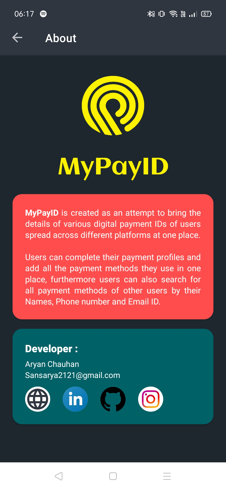
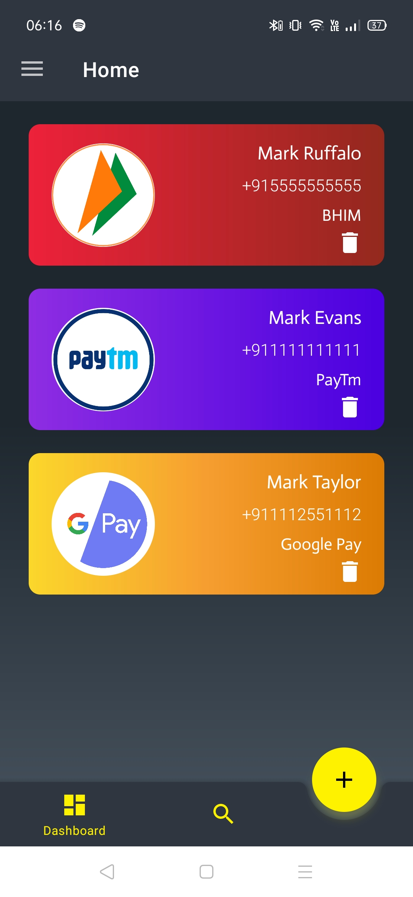
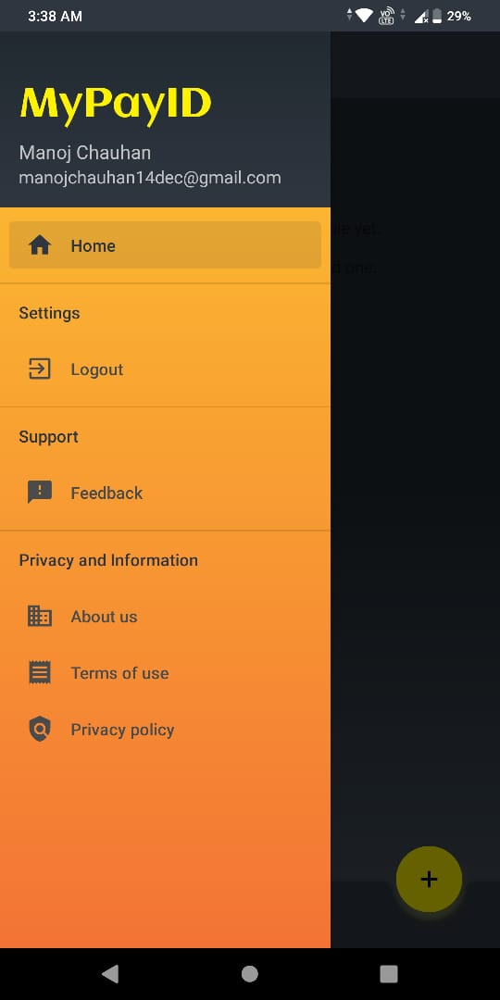
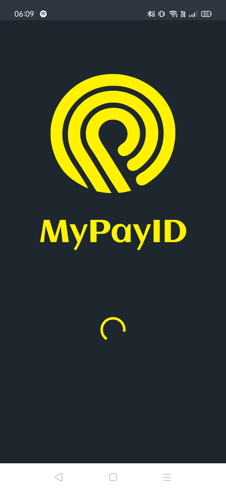
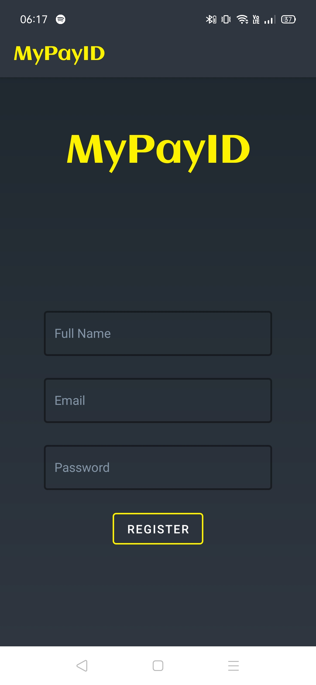
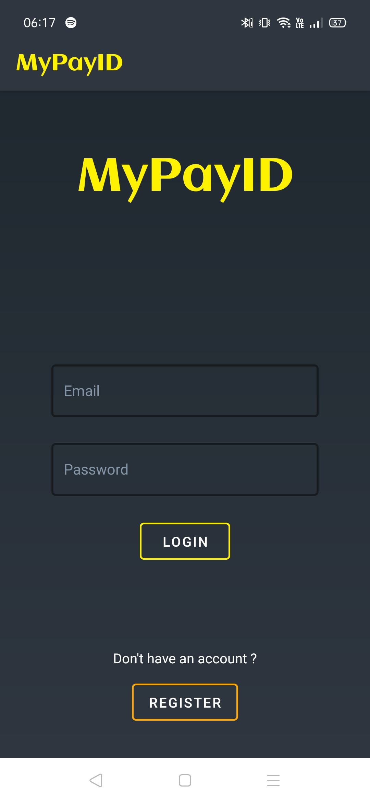
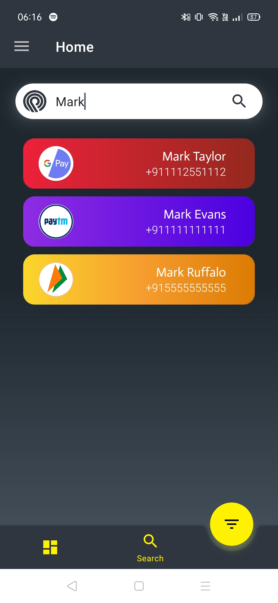

# MyPayID-Android
### MyPayID is created as an attempt to bring the details of various digital payment IDs of users spread across different platforms in one place. Users can complete their payment profiles and add all the payment methods they use in one place, furthermore, users can also search for all payment methods of other users by their Names, Phone number, and Email ID. 

<a href="https://play.google.com/store/apps/details?id=com.leotarius.mypayid"> Click here to see on Play-store </a>

## Some screenshots for illustration :

#### About section :

#### User Dashboard :

#### Side Navigation Pane :

#### Splash Screen :

#### Login screen :

#### Register Screen :

#### Search Results :

